# **Bus Booking System**

## Pre-requisites
* [C#](https://docs.microsoft.com/en-us/dotnet/csharp/)
* [ASP.NET Core](https://docs.microsoft.com/en-us/aspnet/core/?view=aspnetcore-5.0)
* [EF Core](https://docs.microsoft.com/en-us/ef/core/)
* [MSSQL](https://docs.microsoft.com/en-us/sql/?view=sql-server-ver15)

## *Story of this System*
* In this system, there are 3 types of users viz. **Passenger**, **Bus Operator** and **Admin**.
* All the users are required to be authenticated before accessing any resource. Exception is **Anonymous** user, who is not registered with the system but is allowed to book bus ticket(s).
* **Passenger** user will book bus ticket(s) by following these steps:
```
    1.  Enter Trip Details by providing source, destination and date of journey
    2.  Select Bus from the list of available buses
    3.  Select Seats from the seat layout of the selected bus
    4.  Fill Passenger Details corresponding to their Seat numbers
    5.  Ticket Payment for confirming the seat reservation
```
* **Passenger** user can also Cancel Ticket by providing ticket id and email id. 
* **Anonymous** user must be registered as **Passenger** user in order to cancel the ticket.
* **Passenger** user can also Rate for their Journey. This gives user ratings to the bus.
* **Bus Operator** user can see the today's list of passengers whose ticket is booked.
* **Bus Operator** user will check and mark the passengers in the list as they arrived in the Bus.
* **Admin** user will manage the Bus and all the Users registered with the system.
* **Admin** user can create new **Admin** and **Bus Operator** users whereas **Passenger** user is created only from the User Registration module.
* **Admin** user with **Master** role manages the user roles.

## Video Link : [Watch Bus Booking System in Action](https://drive.google.com/file/d/1oE1ePuZhk_N9zpF0g_R-HQaXesZvXcdL/view?usp=sharing)

## Screenshots
<p align="center">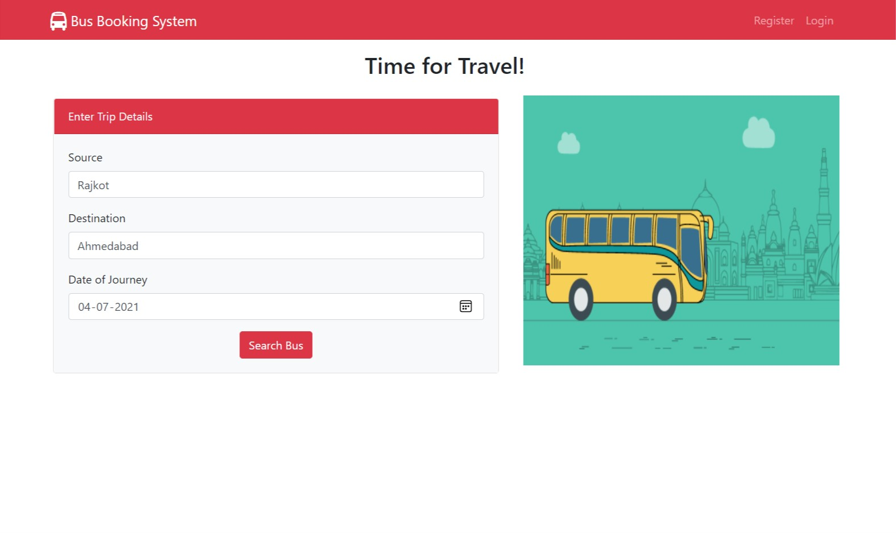</img></p>
<p align="center">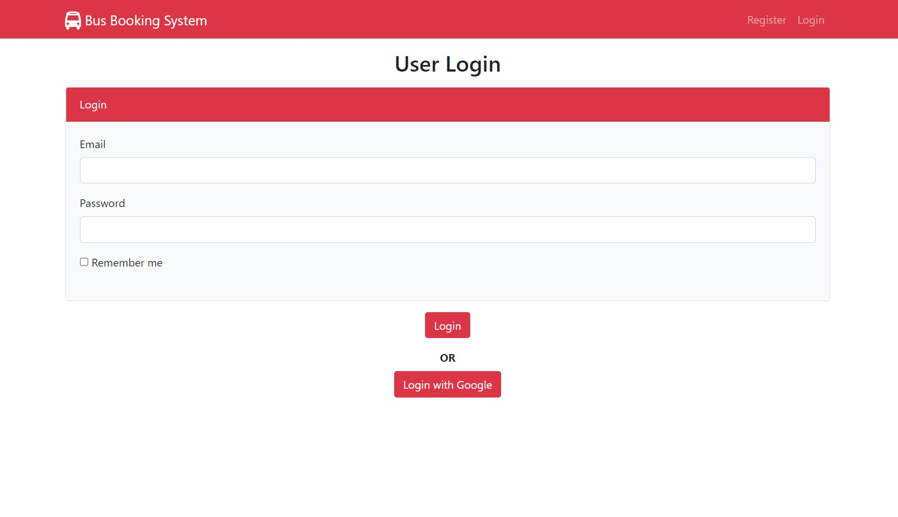</img></p>
<p align="center">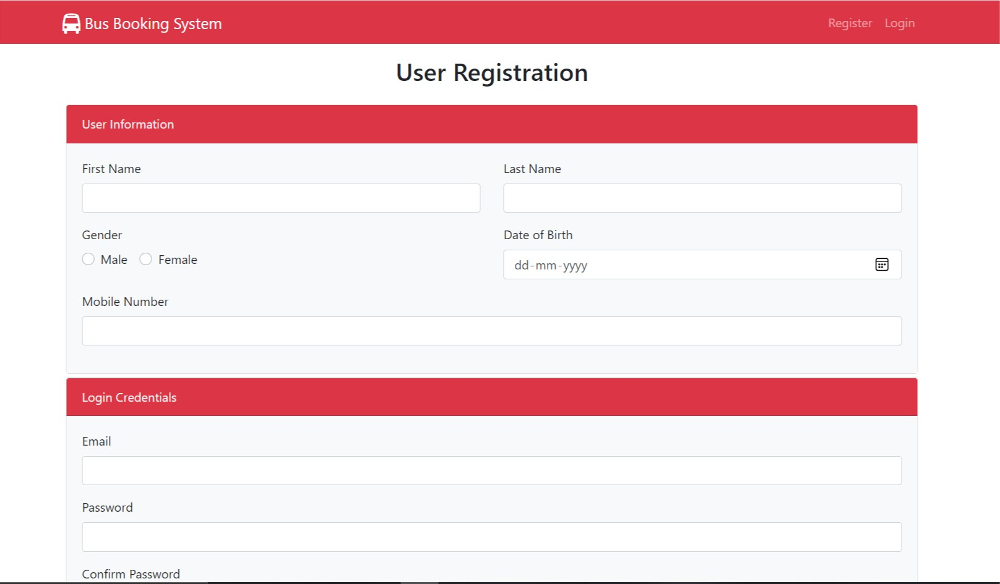</img></p>
<p align="center">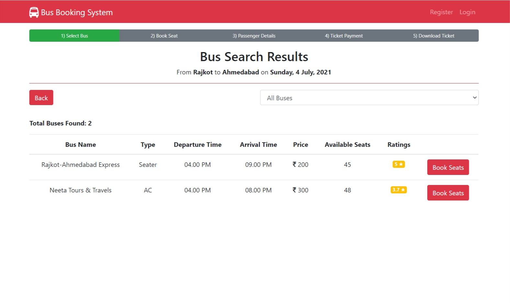</img></p>
<p align="center">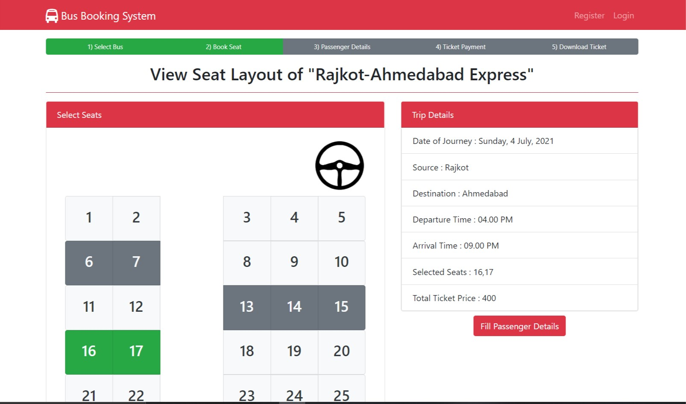</img></p>
<p align="center">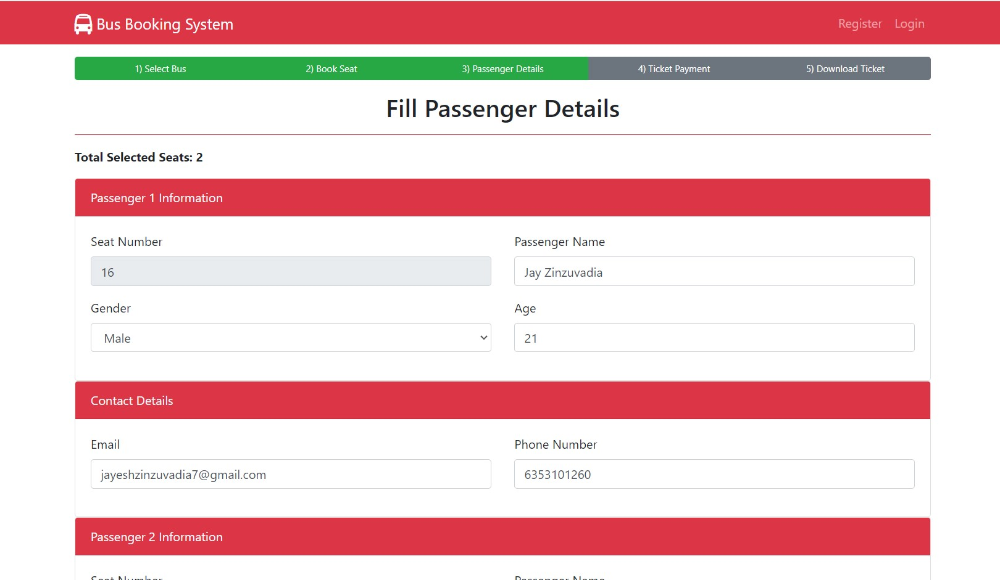</img></p>
<p align="center">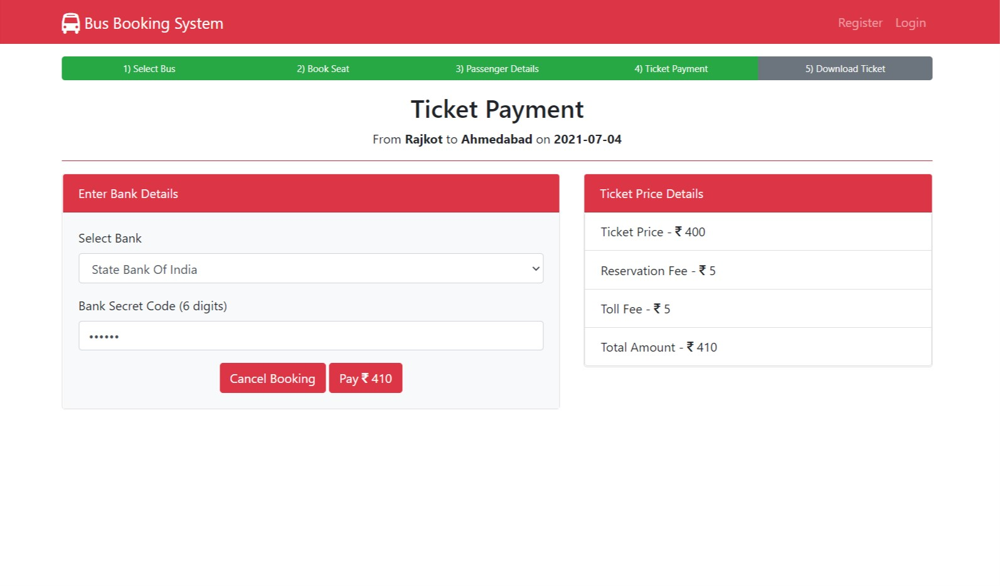</img></p>
<p align="center">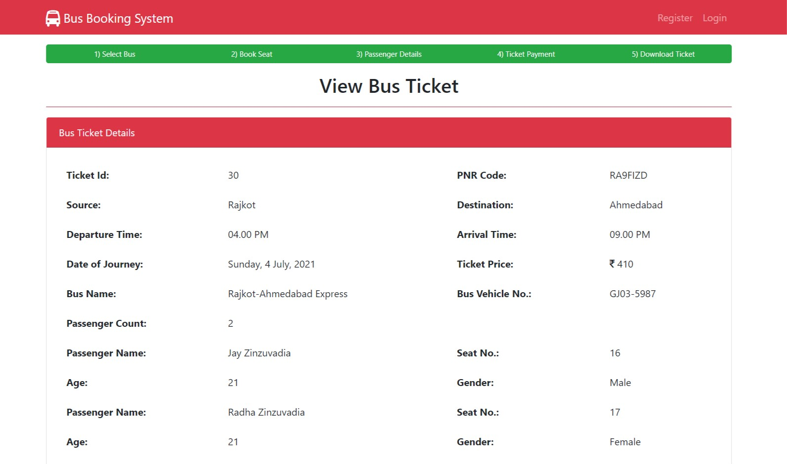</img></p>
<p align="center">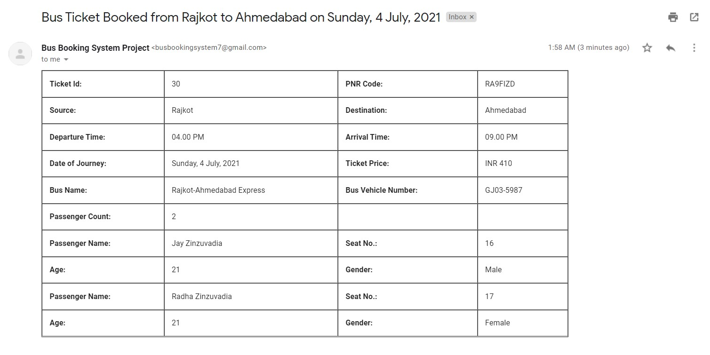</img></p>
<p align="center">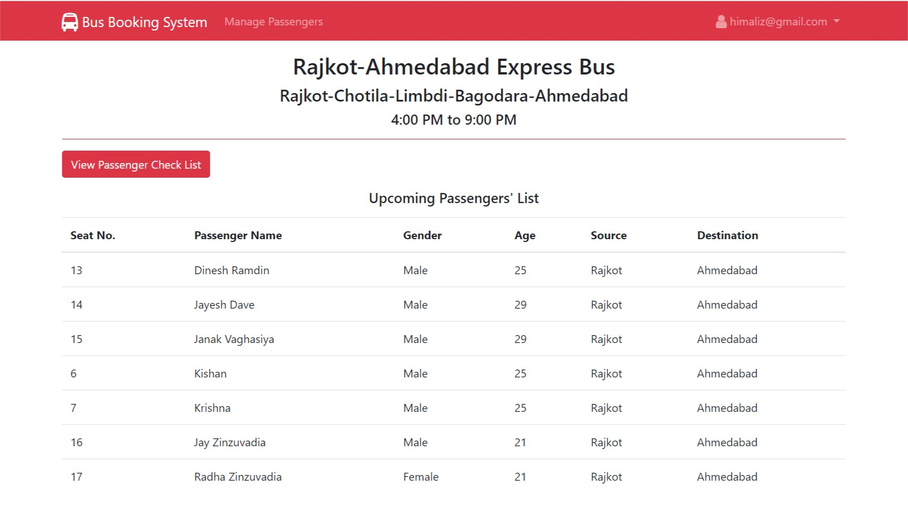</img></p>
<p align="center">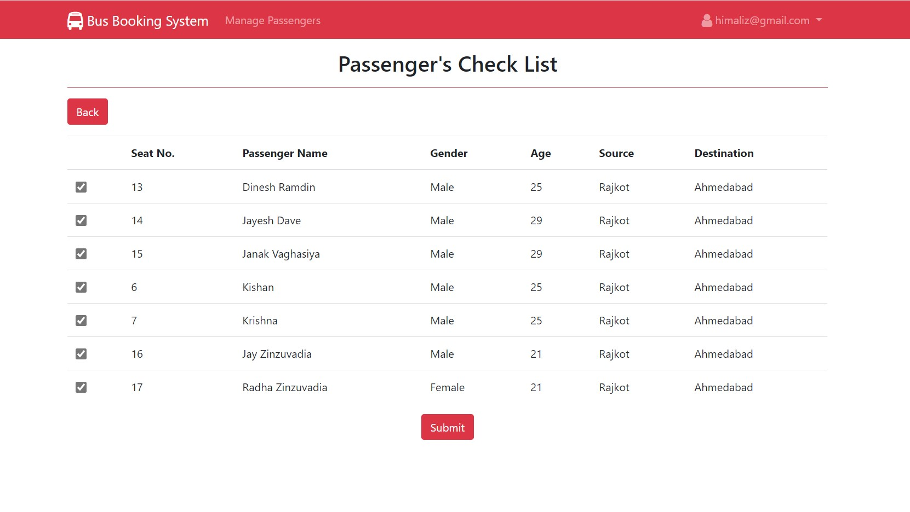</img></p>
<p align="center">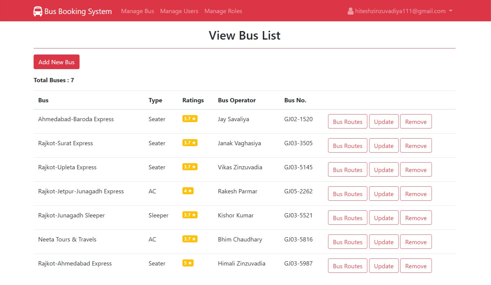</img></p>
<p align="center">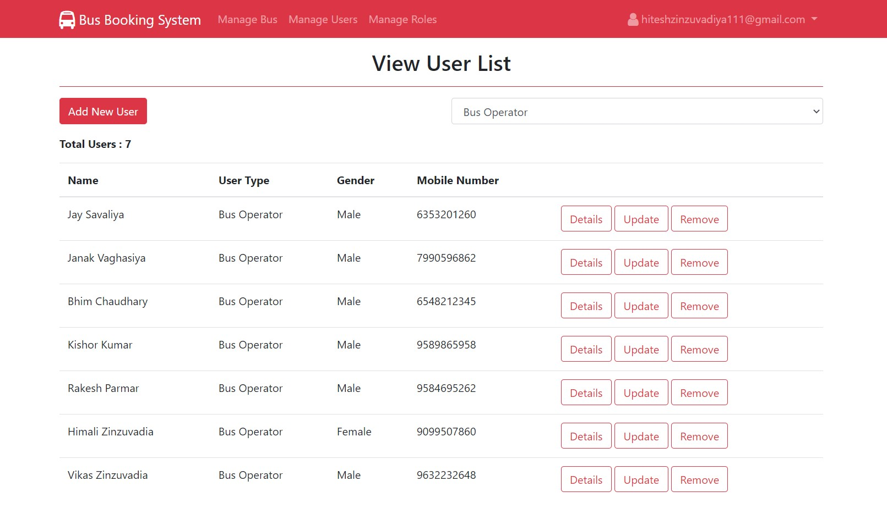</img></p>
<p align="center">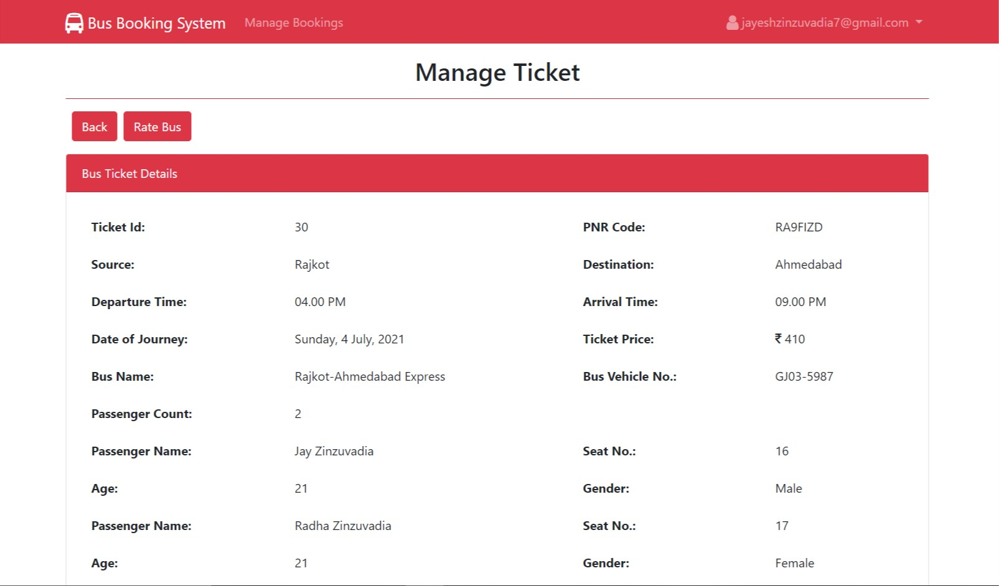</img></p>

## How to set up and run this project
**Note**: My .NET Core version is **3.1** and I am using Visual Studio 2019 IDE.

1. Install the above mentioned pre-requisites on your machine.
2. Place the source code inside your project directory.
3. Open the `BusBookingSystem.sln` or `BusBookingSystem.csproj` file and this will open the project in Visual Studio 2019.
4. Now, download all the necessary packages from the Nuget Package Manager. All the .NET Core and EF core packages are having the version of **3.1.15**.
5. To create the MSSQL database tables, for storing the data, write the following commands in Package Manager Console:
```
    Add-Migration DbInit
    Update-Database
```
6. Now, press `Ctrl + F5` key to run the project locally in your browser.
7. Also, note that initially, **Admin** user is added manually in the database and is assigned the **Master** role.
